# device_systems

API REST construida con FastAPI para la gestión de usuarios.

## GA1-220501096-01-AA1-EV08 – FastAPI Intermedio: Evolución de device_systems con CRUD Completo, Manejo de Errores, Swagger/OpenAPI y Dependency Injection

### Explicación de la estructura

El proyecto fue organizado siguiendo una estructura modular con el fin de repartir responsabiliddaes y facilitar el mantenimiento del proyecto. La carpeta routes contiene los endpoinys de la API y la definición de las rutas disponibles para el recurso usuarios. La carpeta schemas almacena los modelos Pydantic utilizados para validar los datos de entrad y salida. En services se implementó la lógica de negocio relacionada con la gestión de usuarios, como consultas, creación, actualización y eliminación. La carpeta dependencies contiene funciones reutilizables utilizadas mediante Dependeny Injection para validar información y controlar errores. Finalmente, la carpeta data simula una base de datos en memoria donde se almacenan temporalmente los registros de usuarios. Esta organizaxión permite mantener el código más limpio, escalable y fácil de mantener.

### Explicación de cómo se aplicó Dependency Injection

Se implementó utilizando la función Depends() de FastApI. Para ello se creó el archivo user_dependencies.py, donde se definieron funciones reutilizables como get_user_or_404, encargada de buscar un usuario por su ID y generar una exepción cuando el usuario no existe.

### Evidencias
#### Interfaz general
 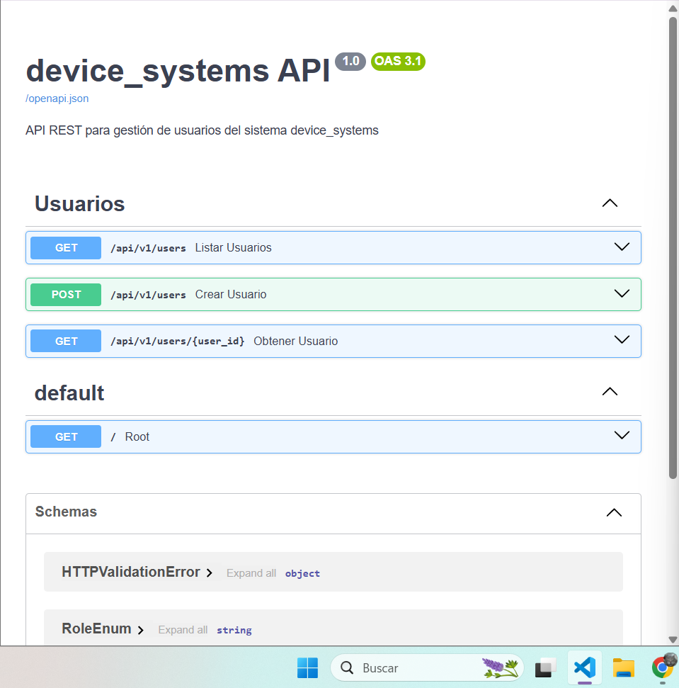

 #### Obtener lista de usuarios
 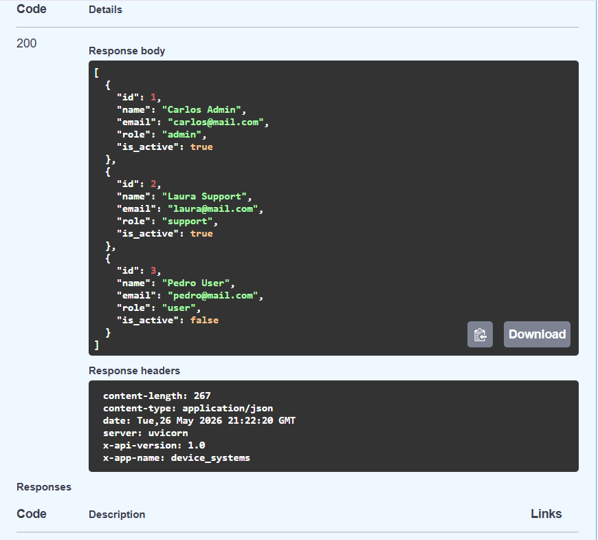

#### Obtener por ID
 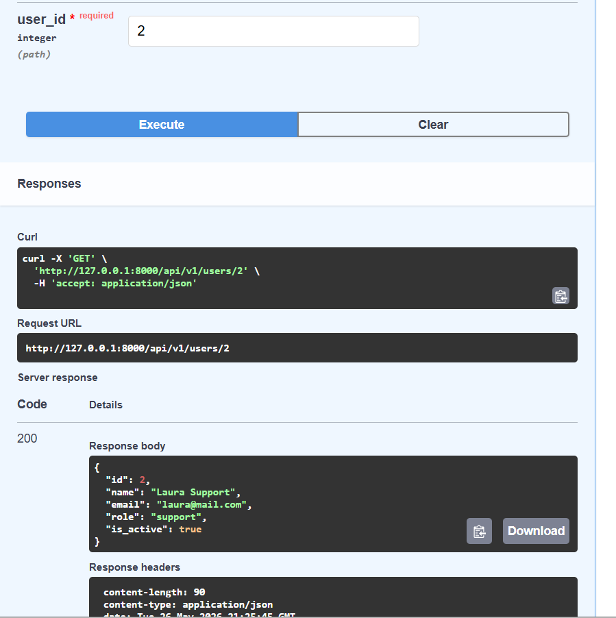

#### Filtrar por rol
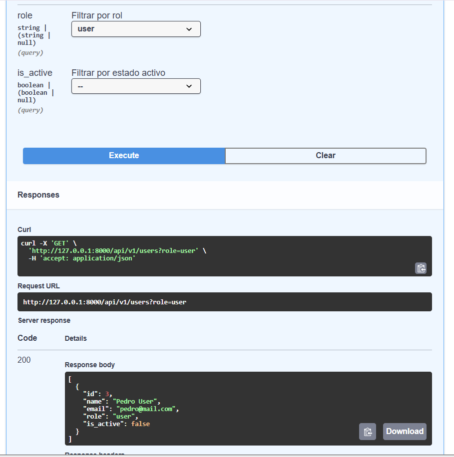

#### Crear usuario
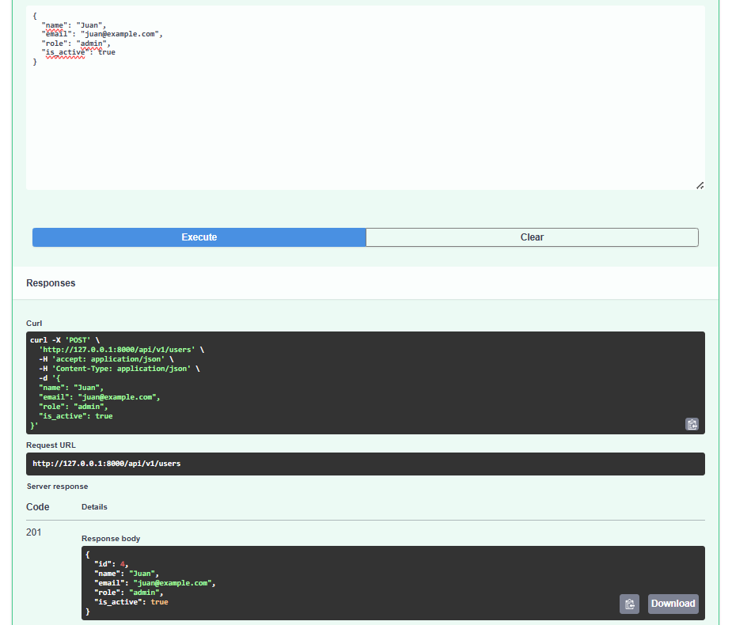

#### Crear usuario (Datos incorrectos)
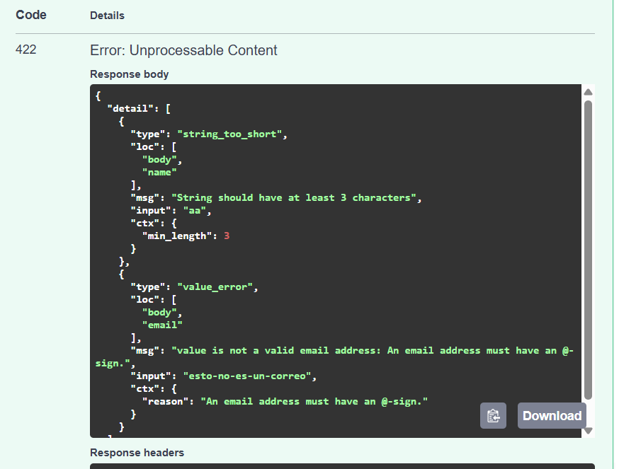

#### Correo repetido
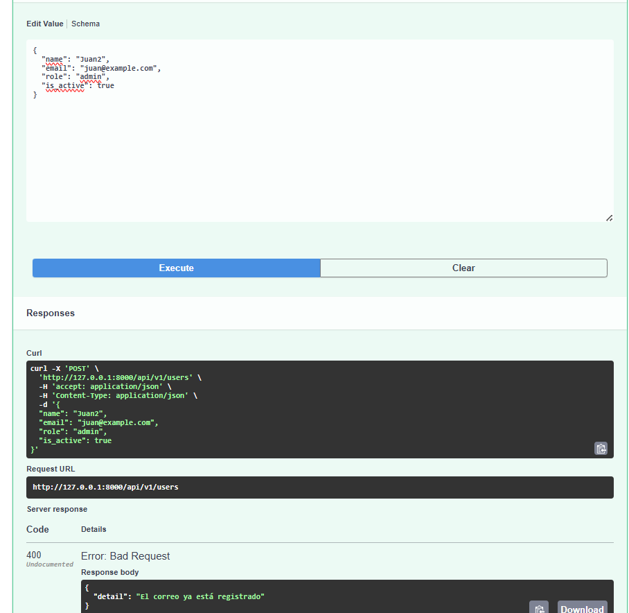

#### No encontrado
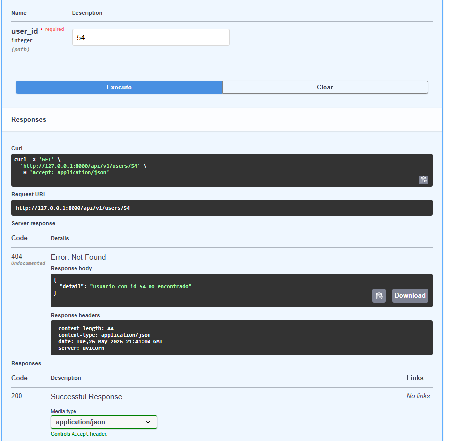

### Reflexión final sobre la evolución del proyecto

Durante el desarrollo de esta actividad fue posible comprender cómo una API REST puede evolucionar desde una implementación básica hacia una solución más profesional y estructurada.

## GA1-220501096-01-AA1-EV09 – FastAPI con SQLAlchemy: Persistencia de Datos y CRUD sobre Base de Datos en device_systems

### Nueva estructura del proyecto: 

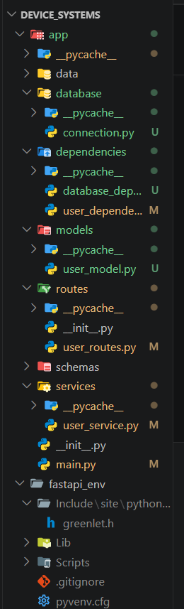

Esta, a diferencia de la estructura que teníamos hasta el paso anterior del proyecto, ahora incluye una base de datos que se ha creado a través de una estructura base en la carpeta database y la instalación de una dependencia que a partir de esta estructura crea la base de datos con SQL

### Base de datos generada

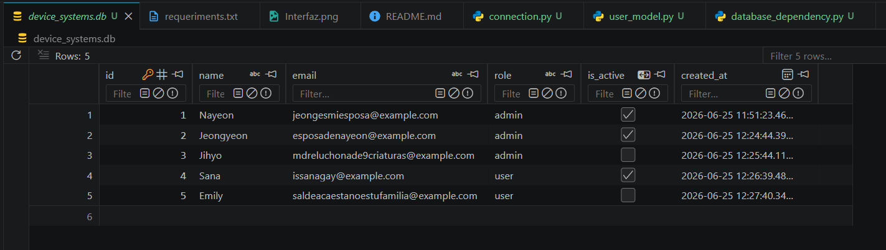

En esta base de datos encontramos los campos ID, nombre, email, role y activo. Tenemos 5 usuarios de prueba para las funciones de la API.

### Evidencias de nuevos endpoints en swagger

#### Usuarios listados en orden de ID (orden predeterminado)

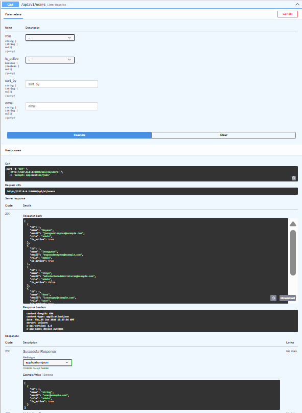

#### Usuarios ordenados por su nombre

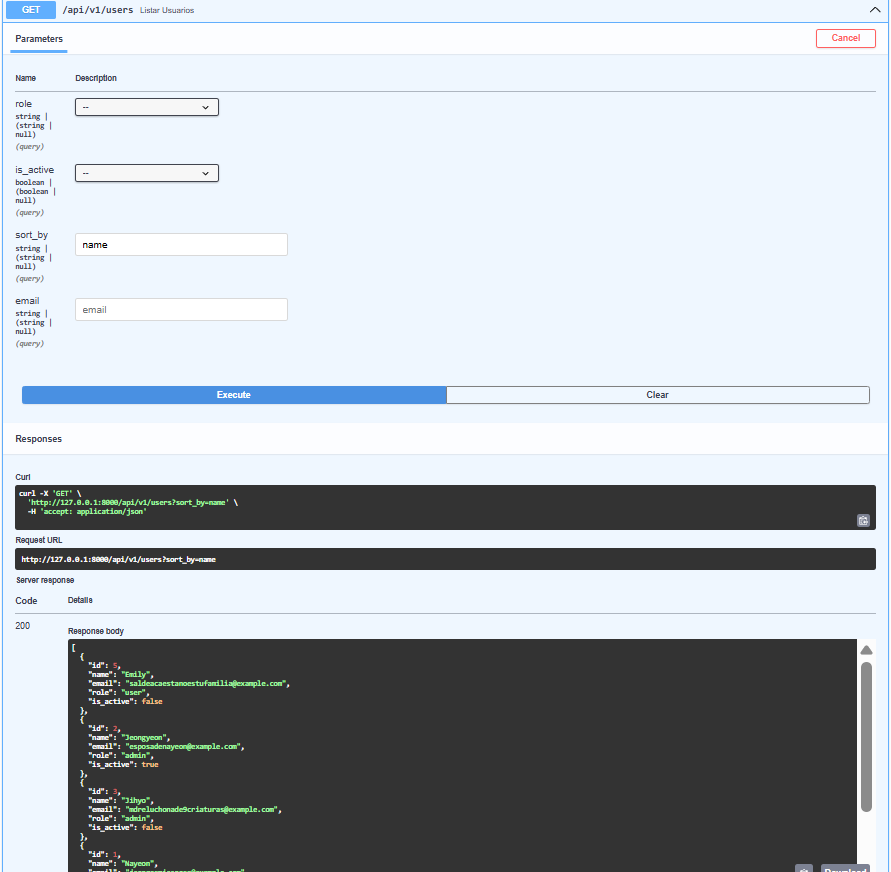

#### Usuarios ordenados por la fecha en la que fueron creados

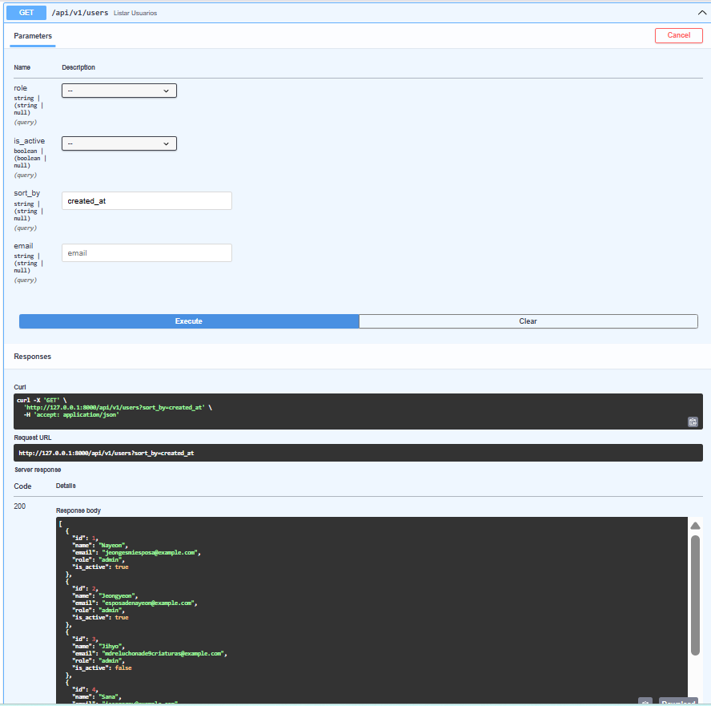

#### Busqueda por email

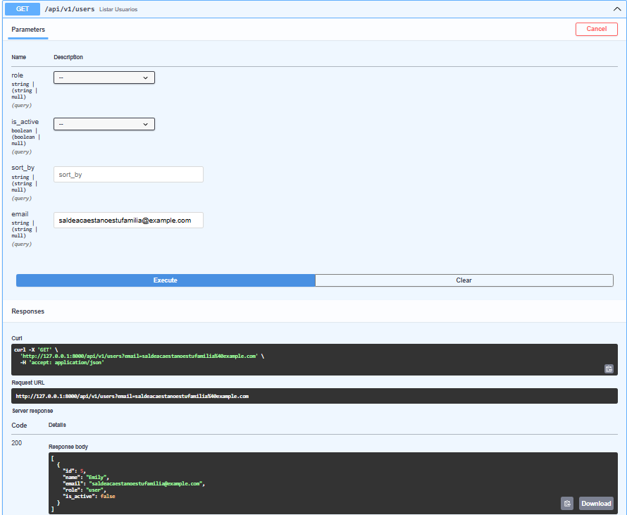

#### Control de errores

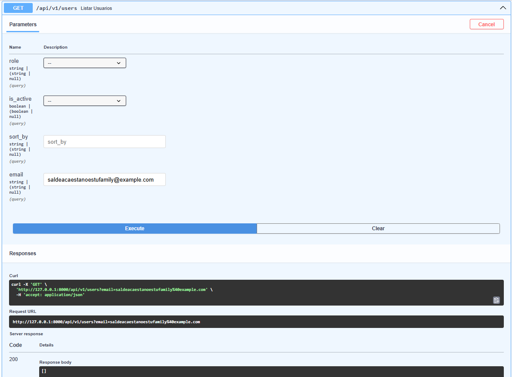
Esta imagen demuestra que si en el filtro de email se coloca un email que no está registrado entonces no muestra ningún usuario.

### Diferencia entre SQLAlchemy y Pydantic
El modelo SQLAlchemy representa una estructura de la tabla en l abase de datos y se utiliza para realizar operaciones CRUD sobre los registros almacenados. Define columnas, tipos de datos y restricciones como claves primarias, valores únicos y campos obligatorios.

Por otro lado, los schemas Pydantic se utilizan para balidar los datos que ingresan o salen de la API. Estos schemas garantizan que la información recibida cumpla con las reglas definidas antes de ser procesada por la aplicación.

En este proyecto, el modelo User representa la tabla users en SQLite, mientras que los schemas UserCreate, UserUpdate, UserPatch y UserResponse controlan la validación y serialización de los datos intercambiados mediante la API.

### Reflexión final
La incorporación de persistencia de datos mediante SQLAlchemy permitió transformar la API de un sistema basado en datos temporales a una solución capaz de almacenar información de forma permanente. A diferencia de las estructuras en memoria, la base de datos conserva los registros incluso después de reiniciar la aplicación, lo que la hace más cercana a un entorno real de producción.